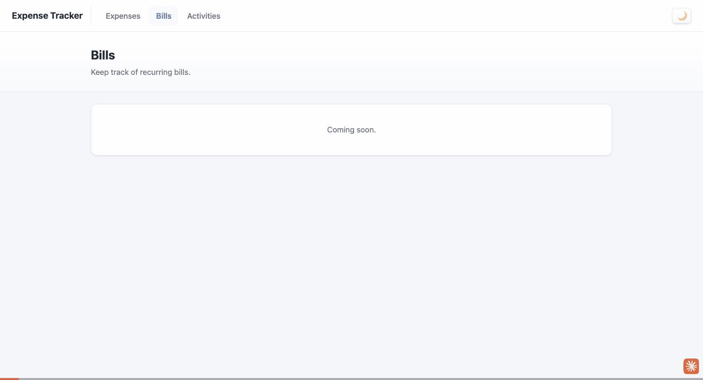

# Browser Test Report: Expense Tracker

- **Date:** 2026-09-28
- **Tested by:** Claude Code, using Claude in Chrome
- **URL:** http://localhost:8000 (Python `http.server`)
- **Code tested:** `main` plus the uncommitted thousands-separator change to `formatAmount` in `script.js`
- **Console:** no errors or exceptions during the session

## Visual recording

The GIF shows a second test run with the same results. It covers:
- switching between the Expenses, Bills and Activities tabs;
- turning dark mode on and off;
- submitting an empty form, which is rejected;
- adding Coffee ($4.50) and Refund (-$100);
- editing Coffee to $1,500.00;
- deleting both test expenses.

It also shows the one failure: with Refund in the table, the total stays at $2,729.50 instead of $2,629.50. The error popups don't appear, because they were logged to the console instead (see "How the testing was done").

## Results

| PASS | FAIL |
|---|---|
| Existing data: Groceries $500.00 and Rent $2,225.00 display correctly, and the total ($2,725.00), legend (18% / 82%) and chart screen-reader label all match | Total is wrong when an expense is negative: the form accepts negative and zero amounts, but the total leaves out anything that isn't positive. With Groceries, Rent, Coffee ($4.50) and Refund (-$100) in the table, the rows add up to $2,629.50 but the total showed $2,729.50 |
| Navigation tabs: Bills and Activities each show their own page ("Coming soon."), the clicked tab is highlighted, and the other pages are hidden | |
| Navigation tabs: switching back to Expenses keeps the expense data | |
| Theme toggle: switches to dark mode (☀️ icon, dark background, readable text) and back to light mode (🌙 icon) | |
| Validation: an empty form, a name made only of spaces, and a name with no amount are all rejected with an error message | |
| Adding: Enter or the Add Expense button adds the expense, clears both fields and puts the cursor back in the name box | |
| Thousands separator: amounts show commas in the table and total, e.g. $2,225.00 and $1,500.00, including after editing | |
| Editing: Edit fills the row's fields and puts the cursor in the name box, Enter saves, and Escape discards the change | |
| Unsaved-changes prompt: answering "No" keeps the text you've typed, and answering "Yes" switches to the other row | |
| Delete: answering "No" keeps the row, and answering "Yes" removes it | |

### Cause of the failure
In `script.js`, `renderChart()` adds up only the positive amounts to get the total, but `validateExpense()` accepts any number, including zero and negatives. So the table and the total can disagree.

## Minor issues

- **Negative amounts display as `$-100.00`**, not `-$100.00`. This goes away if negative amounts are rejected.
- **Legend percentages are rounded to whole numbers.** A small expense shows as "Coffee 0%", and one set of percentages added up to 101% (12% + 53% + 36%).
- **Nothing survives a reload.** Expenses and the theme are never saved, so reloading the page clears all the data and goes back to light mode.
- **The browser can use an old copy of `script.js` after a code change.** A normal reload may not pick up the change, but a hard reload (Cmd+Shift+R) does.

## Test data used

| Name | Amount | Purpose | Kept? |
|---|---|---|---|
| Groceries | 500 | Existing data | Yes |
| Rent | 2225 | Existing data, thousands separator | Yes |
| *(empty)* | *(empty)* | Empty form | Rejected |
| `"   "` (spaces only) | 5 | Name made only of spaces | Rejected |
| Coffee | *(empty)* | Missing amount | Rejected |
| Coffee | 4.5, then edited to 1500 | Adding, editing, separator after an edit | Deleted after testing |
| Refund | -100 | Negative amount | Deleted after testing |
| Freebie | 0 | Zero amount; also used to test Escape and the unsaved-changes prompt | Deleted after testing |

When testing finished, the page showed only Groceries and Rent again.

## Bugs are intentionally not fixed yet

The failure and minor issues above are **documented on purpose and not fixed yet**. They will be dealt with later. No project code was changed because of this testing.

## How the testing was done

- **Popups:** the app uses `alert()` and `confirm()`, which would freeze the browser connection. In the open tab only, they were replaced with versions that log to the console so "Yes" or "No" could be chosen. The project files weren't touched, and a reload restores the real popups.
- **What was checked:** results were confirmed by reading the page's elements, taking screenshots and checking the console.
- **Not retested:** the empty "No expenses yet" message was seen on first load but not retested, because that would have meant deleting the existing data.
